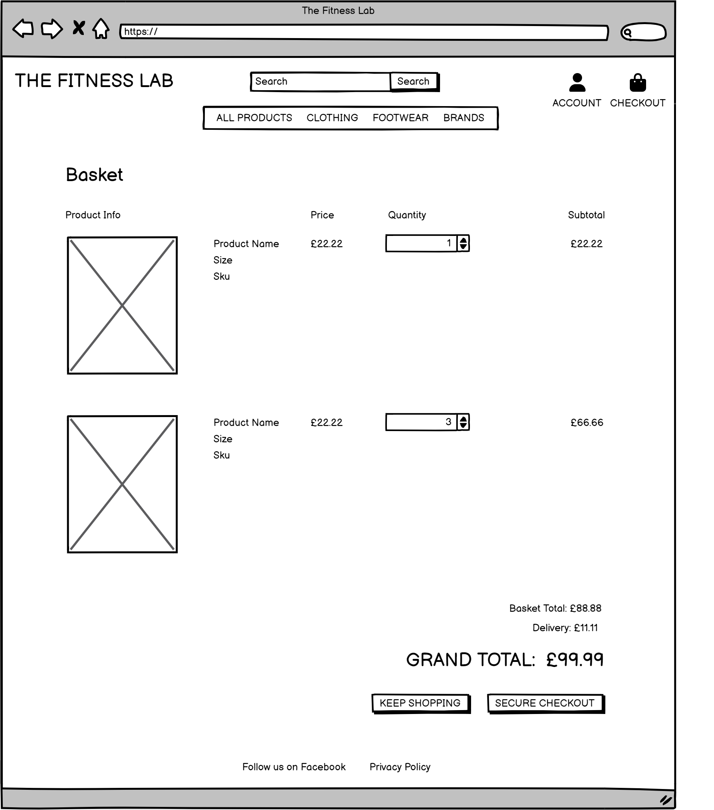
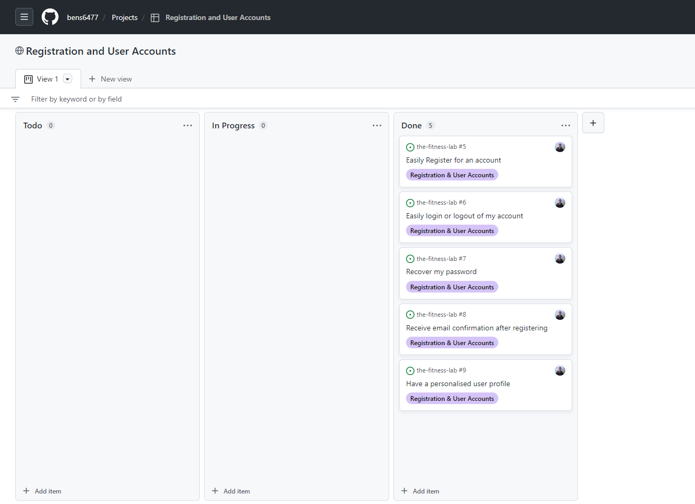

# The Fitness Lab


## Site Overview

[Live Site Link](https://thefitnesslab.herokuapp.com/)


## Business Model

## User Experience
### Strategy

### The Problem
From personal experience and research when looking for fitness products, I found that the fitness
product market is oversaturated with companies requesting high costs and profit margins to sell
their products at too high a cost to the consumer for the true value and quality of the product.

### The Solution
My course of action is to continuously source the best fitness brands from all over the world, making
the perfect combination of the highest quality products consumers will love, want and need for
prices they can afford.
My products are from reputable brands that are established and known for their quality and
durability. These products are ones which even the top athletes can vouch for, used daily by the best
there is.
Doing so ensures we create and build a loyal client base, ensuring we collaborate with big brands
and influencers to get The Fitness Lab name known as the go to place for all men’s fitness needs.
Overtime we will share stories of the fitness goals and limits our customers have achieved using our
products.
Through creating strong customer and stakeholder relationships we can build our name and grow
our business to further take on bigger brands and create amazing marketing, and a great website
accessible for all in one click.

### Target Audience
Men looking to buy fitness equipment and products - who want the best quality at affordable prices.
These men strive to meet their fitness gaols and needs – from beginners to worldwide athletes. The
Fitness Lab is for men to find products they love so they can use them to keep active, improve health
and wellbeing, while not denting their bank accounts too much.

### Persona
Simon, 38, single. Works from home and doesn’t get enough exercise or steps in
throughout the week. His job becoming remote after the pandemic has led him to
neglect all gym goals as his office was round the corner from his gym and the
motivation to get up and go has left him. Simon wants to find a website that inspires him to use brands he know will make his journey and gym process easy and comfortable at prices that won’t put him off. The Fitness Lab has sizes and sportswear that fit everyone and Simon appreciates comfort over everything.

### Testimony
Averil, 50, mother to Jamin now 17, had both gone through some struggling times when Jamin was
15 as he was overweight and out of breathe easily - unable to feel confident in his skin. This led
Averil to research and buy Jamin fitness clothes of the best quality brands and she states that The
Fitness Lab made the whole process so much easier and left her feeling confident she invested in the
right products to help improve Jamin’s fitness. At a pivotal age Jamin felt like he wasn’t able to join
sports clubs or play sports without stopping due to poor stamina when his peers where all able to.
The Fitness Lab helped ensure Jamin had access to the best brands at prices Averil could afford and
ignited his new found confidence which led him to push himself to improve his fitness from football
with friends, sports clubs at school and even now as a 17 year old fitness influencer for many men to
look up to.


### Marketing Strategy
* The main goal of The Fitness Lab is to create a brand men can truly believe in and
feel secure purchasing their fitness products from. We aim to increase our customer
base from sourcing only top quality brands even the best athletes can vouch for. We
will increase our sales by being the number one company customers and
stakeholders go to for the best fitness brands at prices customers can afford.

* This is where The Fitness Lab Website comes in. Having a strong brand and website
to start our company means we can build loyal consumer relationships using our
easy to use website to show customers how smooth and secure The Fitness Lab
experience is. This creates a positive, growing online presence bringing with it
everyday customers as well as highly respected athletes, reaching audiences across
the globe as our popularity increases in line with the increases of our market scale
and scope.

* With a well-functioning website and a social media page as our beginning point, we
can begin to reach further audiences and men on social media – branching out with
advertisement in gyms, on sports programmes and at live sporting events. This will
help us to create a profit used to continuously grow our range of products and the
brands we partner with while also evolving our SEO – building a whole host of
features in the future such as a fitness gym website with plans tailored to suit
individual fitness gaols using only our products, educational resources and stories of
men who have worked with The Fitness Lab and used our company to better their
health and wellbeing and continuous improvements to grow as a whole, becoming
the perfect formula for your fitness needs.


## Planning

### User Stories
#### Viewing & Navigation
1. As an online shopper I want to have the ability to screen a variety of different products on a list so that I can add them to my basket to purchase.
1. As an online shopper I want to have the ability to screen details about items specific to that product to understand the cost, description and criteria, the rating, an image of the product available to me.
1. As an online shopper I want to have the ability to see easily and swiftly find product deals or special offers that I can utilise to save money on my purchases.
1. As an online shopper I want to have the ability to see my final purchase cost on the screen at any point of my online shopping experience to keep track of spending and limit over spending.

#### Registration & User Accounts
5. As a user of an online shopping site, I want to have the ability to create and register for an account with ease so that I can have an online profile and personal account with the site that I can view when I please.
1. As a user of an online shopping site, I want to have the ability to access my account by logging in and logging out when I want to ensure that I can always get access to my personal information.
1. As a user of an online shopping site, I want to have the ability to create and change my passwords and recover old or lost passwords in times I may forget it to ensure I can always get access to my account.
1. As a user of an online shopping site, I want to have the ability to be given confirmation via email that my registration has been successfully completed so I can be sure that my account is fully verified and successful.
1. As a user of an online shopping site, I want to have the ability to be given confirmation via email that my registration has been successfully completed so I can be sure that my account is fully verified and successful.

#### Sorting & Searching
10. As an online shopper I want to have the ability to sort the product lists in terms of availability to allow for easily identifying the best related products, best priced products and products sorted in terms of their category.
1. As an online shopper I want to have the ability to adjust and order a category I choose of a specific product to easily view the best rated product in that specific category or order these products by their name.
1. As an online shopper I want to have the ability to adjust and order various categories of products at the same time to find best priced and rated products across a wide range of categories, such as “T-Shirts” or “Shorts”.
1. As an online shopper I want to have the ability to look up and search products using their name or their description to easily find the exact product I’d want to purchase.
1. As an online shopper I want to have the ability to easily view the products I search for, and the total number of results associated so I can make a quick decision on if the product I want exists and is available.

#### Purchasing & Checkout
15. As an online shopper I want to have the ability to select with ease the and quantity of the product I am purchasing to be certain I don’t select the wrong item/product, quantity by accident.
1. As an online shopper I want to have the ability to view any items I have added to my bag/basket that I may purchase to ensure I am fully aware of the total cost of my purchase and what items I will be receiving.
1. As an online shopper I want to have the ability to amend the quantity of separate items in my basket so that I can make changes if I’d like to prior to checking out.
1. As an online shopper I want to have the ability to enter my payment information easily so that I can have a quick and comfortable check out experience without hassle.
1. As an online shopper I want to have the ability to feel safe using the site to purchase my items and giving my payment information so that I can be confident providing the necessary information to purchase the desired products.
1. As an online shopper I want to have the ability to have confirmation of my order and see that it has been completed so that I can ensure that no mistakes have been made.
1. As an online shopper I want to have the ability to have confirmation of my order and see that it has been completed so that I can ensure that no mistakes have been made.

#### Admin & Store Management
22. As the owner of an online store, I want to have the ability to create and upload new items/products so that I can grow my inventory.
1. As the owner of an online store, I want to have the ability to make amendments and changes to my products so that I can keep up with changing costs for the price of products, the images used on the website, details surrounding the products and any other important product information.
1. As the owner of an online store, I want to have the ability to remove any items from my store and delete them so that they are not accessible to purchase on the site.


### Data Model
This project used Object Oriented programming, utilising model classes to define data. PostgreSQL and ElephantSQL were used to create a relational database of objects. Seven different models were created covering the product catalogue and the journey of the customer from browsing to checkout. These include Item, Brand, Category, Review, Newsletter, Order, OrderLineItem, UserProfile and User. Data fields were defined for each parameter and foreign key fields were used to reference objects in different tables


### Wireframes
This site uses a familiar web design pattern to provide a seamless and instinctual experience to the users. The logo was placed in the top left corner with the navigation menu and search bar placed centrally on the top of the screen, alongside personal information and basket links to the right. The pages have large titles, clearly indicating the subject of the proceeding content, and the body of the page is layed out to contain a large amount of information in a small space without being overcrowded or too busy. It accentuates the key content - the products - by making the focus of product and product detail pages the item images themselves. The footer also clearly indicates how users can find out more through Facebook and reading the company's privacy policy. Wireframes were constructed for each page using Balsamiq and are shown below.

#### Home Page


#### Products Page Page


#### Product Detail Page


#### Basket Page


#### Checkout Page


### Agile Approach
This project was implemented using an Agile approach to take advantage of the iterative and incremental development.

A key advantage of this approach was the iterative and incremental development, which created a highly adaptable and efficient work schedule. Tasks were completed in stages to fulfil user stories, which incrementally improved the functionality of the website. The project was split into 5 day iterations, to review progress and adjust the work schedule accordingly.

GitHub Projects was used to organise the project tasks and timeline. A kanban board was used to move user stories across To Do, In Progress and Done columns according to their status.

#### Epics
* Viewing & Navigation
* Registration & User Accounts
* Sorting & Searching
* Purchasing & Checkout
* Admin & Store Management


#### Sprints

##### Sprint 1 (Viewing & Navigation)


##### Sprint 2 (Registration & User Accounts)


##### Sprint 3 (Sorting & Searching)


##### Sprint 4 (Purchasing & Checkout)


##### Sprint 5 (Admin & Store Management)


## Features

### Header
### Home Page
### Brands
### Products / Store
### Product Details
### Basket
### Checkout
### Order Confirmation & History
### User Profiles
### Product Management
### Error Pages


## Future Enhancements
Various additional features would bring a greater user experience to the website:
* Allow only users who have bought items to give items reviews and ratings.
* Allow users to interactively add a rating to the products.
* Add a sale and deals section and have the first products a customer see be items on sale.
* Add a wishlist so users can add products which they would like to buy in the future to.
* Add a related products section where users can see similar products to the one they are currently viewing.


## Marketing

A Facebook page was created to help generate business for the site and to raise awareness of the brand.

Using organic social media will be a key way in developing the business. The aim is to have a presence on other social media sites such as Twitter, Instagram and LinkedIn as these are the main social media channels young adult men would use.

Using paid social media will also be a key target as focussing on advertising to users who have already visited the site will increase revenue. This can cost a significant amount but, when used correctly and intentionally, in the long term it will produce good results.

Email marketing will be a key part in increasing website traffic where The newsletter sign-up is the first stage of retrieving emails.

Using paid adverts such as Google ads will not initially be a priority due to the cost but will be in the future.


## Technology Used

### Languages
* HTML - Creating and adding content
* CSS - Styling content
* [JavaScript](https://www.javascript.com/) - Manipulating DOM content
* [Python 3](https://www.python.org/downloads/) - Backend code for writing classes methods and functions.

### Extensions
* [Django](https://www.djangoproject.com/) - Full stack framework with convenient shortcuts for effective website backend. Allauth and Coverage extensions were also used for users authentication and testing code coverage respectively.
    * [django-allauth](https://django-allauth.readthedocs.io/en/latest/index.html) - used to handle the site users' accounts, including sign up, login and logout features.
    * [django-crispy-forms](https://django-crispy-forms.readthedocs.io/en/latest/) - used for additional formatting and functionality of the site forms
    * [django-countries](https://pypi.org/project/django-countries/) - used to btaining a list of countries for customers to select at the checkout form
    * [django-storages](https://django-storages.readthedocs.io/en/latest/) - used to connect to Amazon S3 for storing the site's static and media files
* [Stripe](https://stripe.com/) - API used to confirm and handle customer payments
* [ElephantSQL](https://www.elephantsql.com/) - Database integrated with Heroku
* [Bootstrap](https://getbootstrap.com/) - Website structure and styling
* [jQuery](https://jquery.com/) - Implement javascript easily through the jQuery syntax
* [Font Awesome](https://fontawesome.com/v5.15/icons/) - Font icons

### Development & Deployment
* [Heroku](https://www.heroku.com/home) - Site deployment
* [Amazon S3](https://aws.amazon.com/s3/) - Storage of all media and static files for the deployed site on Heroku
* [GitPod](https://www.gitpod.io/) - IDE for local development
* [GIT](https://git-scm.com/) - Version Control
* [GitHub](https://github.com/) - to host the repositories for this project and the live website preview


## Testing
### Validator Testing
* HTML
    * No errors were found when running the HTML code through the [official W3C validator](https://validator.w3.org/)
* CSS
    * No errors were found when running the CSS code through the [official W3C Jigsaw validator](https://jigsaw.w3.org/css-validator/)
* JavaScript
    * No errors were found when running the JavaScript code through the [JSHint validator](https://jshint.com/).
* Python
    * No errors were found when running the Python code through the [PEP8 online validator](http://pep8online.com/).
* Accessibility
    * A high level of accessibility was returned when Lighthouse was ran in Google Chrome developer tools

### Flake8 Linting Errors
* All linting errors returned by flake8 were fixed to ensure that the code was written to the *** python standard.
* Linting errors within <code>.vscode/arctictern.py</code> as this was predefined code and in the <code>migrations</code> folders in all apps were ignored as this was system generated code.
* An error in the <code>checkout/apps.py</code> file saying that <code>'checkout.signals' imported but unused</code>. However, this is imported during runtime and is used within other files, therefore this error was ignored.


### Unfixed Bugs
* No known bugs have been left unfixed

### Manual Testing
All user stories were tested manually to ensure that all functionality was working as expected and provided the desired features to the users and admins of the site.

User Story | Pass
--- | :---:
As an online shopper I want to have the ability to screen a variety of different products on a list so that I can add them to my basket to purchase. | ✅ |
As an online shopper I want to have the ability to screen details about items specific to that product to understand the cost, description and criteria, the rating, an image of the product available to me. | ✅ |
As an online shopper I want to have the ability to see my final purchase cost on the screen at any point of my online shopping experience to keep track of spending and limit over spending. | ✅ |
As a user of an online shopping site, I want to have the ability to create and register for an account with ease so that I can have an online profile and personal account with the site that I can view when I please. | ✅ |
As a user of an online shopping site, I want to have the ability to access my account by logging in and logging out when I want to ensure that I can always get access to my personal information. | ✅ |
As a user of an online shopping site, I want to have the ability to create and change my passwords and recover old or lost passwords in times I may forget it to ensure I can always get access to my account. | ✅ |
As a user of an online shopping site, I want to have the ability to be given confirmation via email that my registration has been successfully completed so I can be sure that my account is fully verified and successful. | ✅ |
As a user of an online shopping site, I want to have the ability to be given confirmation via email that my registration has been successfully completed so I can be sure that my account is fully verified and successful. | ✅ |
As an online shopper I want to have the ability to sort the product lists in terms of availability to allow for easily identifying the best related products, best priced products and products sorted in terms of their category. | ✅ |
As an online shopper I want to have the ability to adjust and order a category I choose of a specific product to easily view the best rated product in that specific category or order these products by their name. | ✅ |
As an online shopper I want to have the ability to adjust and order various categories of products at the same time to find best priced and rated products across a wide range of categories, such as “T-Shirts” or “Shorts”. | ✅ |
As an online shopper I want to have the ability to look up and search products using their name or their description to easily find the exact product I’d want to purchase. | ✅ |
As an online shopper I want to have the ability to easily view the products I search for, and the total number of results associated so I can make a quick decision on if the product I want exists and is available. | ✅ |
As an online shopper I want to have the ability to select with ease the and quantity of the product I am purchasing to be certain I don’t select the wrong item/product, quantity by accident. | ✅ |
As an online shopper I want to have the ability to view any items I have added to my bag/basket that I may purchase to ensure I am fully aware of the total cost of my purchase and what items I will be receiving. | ✅ |
As an online shopper I want to have the ability to amend the quantity of separate items in my basket so that I can make changes if I’d like to prior to checking out. | ✅ |
As an online shopper I want to have the ability to enter my payment information easily so that I can have a quick and comfortable check out experience without hassle. | ✅ |
As an online shopper I want to have the ability to feel safe using the site to purchase my items and giving my payment information so that I can be confident providing the necessary information to purchase the desired products. | ✅ |
As an online shopper I want to have the ability to have confirmation of my order and see that it has been completed so that I can ensure that no mistakes have been made. | ✅ |
As an online shopper I want to have the ability to have confirmation of my order and see that it has been completed so that I can ensure that no mistakes have been made. | ✅ |

As the owner of an online store, I want to have the ability to create and upload new items/products so that I can grow my inventory. | ✅ |

As the owner of an online store, I want to have the ability to make amendments and changes to my products so that I can keep up with changing costs for the price of products, the images used on the website, details surrounding the products and any other important product information. | ✅ |
As the owner of an online store, I want to have the ability to remove any items from my store and delete them so that they are not accessible to purchase on the site. | ✅ |


### Bugs

Resolved | Bug | Fix 
:---: | --- | --- 
🟢 | Static files were returning 404 errors | Added `STATICFILES_DIRS` to settings
🟢 | Order confirmation email does not have £ or 2 decimal places | Add £ and floatformat to email template


## Development

### Cloning the Repository

  * Navigate to the main page of this repository
  * Click on the 'Code' dropdown menu to the left of the green 'Gitpod' button.
  * Copy the 'HTTPS url' and then open your own workspace.
  * Go to the terminal of the new workspace and type `git clone` + 'HTTPS url'.
  * Move all the files within the 'fitness_lab' folder into the route directory and delete the empty 'fitness_lab' folder.
  * To install all of the required modules use `pip3 install -r requirements.txt` in the terminal.
  * Type `python manage.py runserver` to run the site.
  * Next, migrate the changes to integrate them to the new database. Add both of the below statements to the terminal:
    * `python3 manage.py makemigrations`
    * `python3 manage.py migrate`
  * To get access to the Django Admin Panel type the below to the terminal and fill in the details:
    * `python3 manage.py createsuperuser` 
  * Finally, add an `env.py` file similar to the below:
```
  import os
  os.environ['DEVELOPMENT'] = 'True'
  os.environ['SECRET_KEY_TFL'] = 'enter_secret_key'
  os.environ['STRIPE_PUBLIC_KEY'] = 'enter_stripe_public_key'
  os.environ['STRIPE_SECRET_KEY'] = 'enter_stripe_secret_key'
  os.environ['STRIPE_WH_SECRET_TFL'] = 'enter_stripe_webhook_secret'`
```

### Integrating Stripe
  * Login to Stripe and sign up for free.
  * To retrieve the stripe STRIPE_PUBLIC_KEY and STRIPE_SECRET_KEY, when first loging in to stripe if, click on the 'Developers' tab and then click on the 'API Key' tab. Both keys can be copied from here.
  * To set up a webhook, first click on the 'Webhooks' tab in the 'Developers' tab
  * Click on 'Add Endpoint' and add the 'home page url' + '/checkout/webhook' similar to https://thefitnesslab.herokuapp.com/checkout/webhook/
  * Click 'Add Endpoint' and click 'Select all events'
  * Retrieve the 'STRIPE_WH_SECRET_TFL' by clicking 'Reveal' on the 'Signing section' of the webhook dashboard.

### Deploying to Heroku
  * Create a 'Procfile' with the following in it making sure to add in the application name: `web: gunicorn fitness_lab.wsgi:application`
  * Login to Heroku on their website and create a new app.
  * Click on the 'Resources' tab and add 'Heroku Postgres' to the Add*ons section.
  * Navigate to the 'Settings' tab in Heroku and click on the 'Reveal Config Vars' section and add in the below config vars:

|**Environment Variable**|**Value**                                           |
|------------------------|------------------------------------------------    |
| AWS_ACCESS_KEY_ID      | Access key provided by AWS                         |
| AWS_SECRET_ACCESS_KEY  | Secret key provided by AWS                         |
| DATABASE_URL           | Automatically Generated by Postgres                |
| EMAIL_HOST_PASSWORD    | Password for the address that sends out emails     |
| EMAIL_HOST_USER        | Email address for sending out emails               |
| SECRET_KEY             | Django secret key                                  |
| STRIPE_PUBLIC_KEY      | Publishable Key provided by Stripe                 |
| STRIPE_SECRET_KEY      | Secret Key provided by Stripe                      |
| STRIPE_WEBHOOK_SECRET  | Webhook Signing Secret provided by Stripe          |
| USE_AWS                | True                                               |
| DISABLE_COLLECTSTATIC  | 1                                                  |

  * Add in the correct 'ALLOWED_HOSTS' urls to settings.py
  * Now login to Heroku in the terminal of your workspace using `heroku login *i`
  * Type `heroku git:remote -a heroku_app_name` into your terminal then `git push heroku main`. This will deploy your app.
  * To migrate the databases to the Heroku Postgres database enter the below statements to your workspace terminal:
    * `heroku run python3 manage.py makemigrations`
    * `heroku run python3 manage.py migrate`

### Set-up Amazon S3
  * Once you're signed into Amazon AWS, navigate to S3 and create a new bucket.
  * In the permissions tab within your bucket add the below to the CORS configuration:

```
[
  {
    "AllowedHeaders": [
      "Authorization"
    ],
    "AllowedMethods": [
      "GET"
    ],
    "AllowedOrigins": [
      "*"
    ],
    "ExposeHeaders": []
  }
]
```
  * Click on 'Policy generator' under the Bucket Policy Tab and add in the ARN + `/*` (which looks similar to `arn:aws:s3:::your-bucket-name/*`) to the generated policies 'Resource' section. Then add the generated policy to the 'Bucket Policy Editor'.
  * Now navigate to the AWS app 'IAM' and create a 'Group' making sure you add in your existing S3 Bucket details.
  * Once you have done this, create a 'New Policy' and 'New User' and add them to your 'Group'.
  * After this, go back to the config variables in the Heroku app and delete the 'DISABLE_COLLECTSTATIC' variable.
  * Deploy again to heroku by entering `git push heroku main` in your terminal and you should be fully set up.


## Credits

### Content
  * [Django Documentation](https://docs.djangoproject.com/en/4.0/)
  * [Stripe Documentation](https://stripe.com/docs)
  * [Amazon S3 Documentation](https://docs.aws.amazon.com/s3/index.html)

### Media
  * [JD Sports](https://www.jdsports.co.uk/) - used for all product images and information.
  * [Pexels](https://www.pexels.com/) -  used for site photos excluding product images.
  * [Balsamiq](https://balsamiq.com/wireframes/) -  used for site wireframes.
  * [drawSQL](https://drawsql.app/) -  used for data model planning and illustration.
